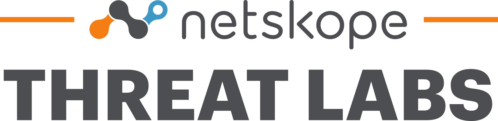

# Netskope Threat Labs - IOCs

Staffed by the industry’s foremost cloud threat and malware researchers, the Netskope Threat Labs discovers, analyzes, and designs defenses against the latest cloud threats affecting enterprises.

In this repository, you will find IOCs, Yara rules and scripts related to Netskope Threat Labs research articles. For more details, please visit https://www.netskope.com/netskope-threat-labs.